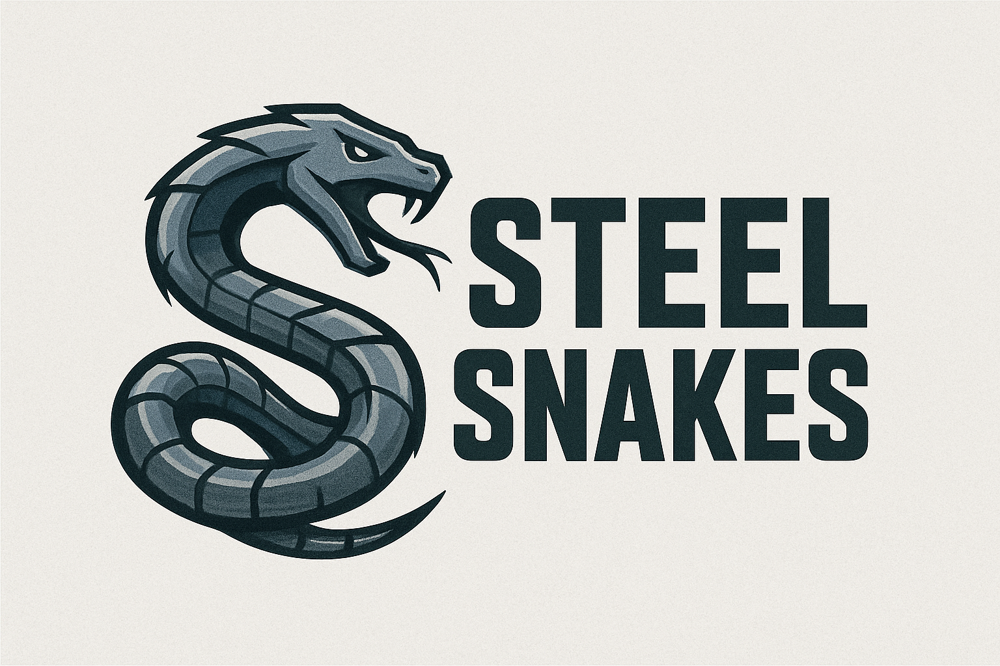

# `steelsnakes`



<div align="center">
  <p>
  <!-- python version -->
    <a href="https://python.org"></a>
    <!-- license -->
     <a href="./LICENSE.md"></a>
    <!-- pypi version -->
     <a href="https://pypi.org/project/steelsnakes/"></a>
    <!-- documentation -->
    <a href="https://steelsnakes.readthedocs.io/"></a>
    <!-- build status -->
    <!-- <a href="#"> -->
    <!-- pypi stats -->
    <a href="https://pepy.tech/projects/steelsnakes"></a>
    

  </p>
</div>

A python library for structural steel.
Currently supports 🇬🇧 UK, 🇪🇺 EU, 🇺🇸 US.
Active development: 🇮🇳 IN.
Legacy code: 🇬🇧 BS (BS 5950-1:2000 classification and member checks on UK sections).
Sections only, no checks yet: 🇺🇸 US_Metric (AISC shapes in SI units).
Scaffolded/early modules: 🇦🇺 AU, 🇳🇿 NZ, 🇯🇵 JP.
Future expansion candidates: 🇲🇽 MX, 🇿🇦 SA, 🇨🇳 CN, 🇨🇦 CA, 🇰🇷 KR.

## Quick Start

### Installation

```bash
pip install steelsnakes
```

For local development:

```bash
python -m venv .venv
source .venv/Scripts/activate   # Windows (Git Bash)
pip install -e .
```

### Basic Usage

```python
from steelsnakes.UK import UB, UC, PFC

# Create section objects using the designations
beam = UB("457x191x67") # Universal Beam
column = UC("305x305x137") # Universal Column
channel = PFC("430x100x64") # Parallel Flange Channel

# Access properties immediately
print(f"Beam moment of inertia: {beam.I_yy} cm⁴")
print(f"Column mass: {column.mass_per_metre} kg/m")
print(f"Channel shear center: {channel.e0} mm")
```

## Documentation

- **[First Steps](https://steelsnakes.readthedocs.io/en/latest/01-guides/01-first-steps/)** - Get started quickly
- **[Codes and Standards](https://steelsnakes.readthedocs.io/en/latest/01-guides/03-codesandstds/)** - Coverage and standards context
- **[EU Classification Guide](https://steelsnakes.readthedocs.io/en/latest/01-guides/05-eu-classification/)** - Eurocode classification background
- **[US Member Checks](https://steelsnakes.readthedocs.io/en/latest/02-api-reference/05-us-member-checks/)** - AISC 360-22 Chapters C to H
- **[BS 5950 Classification](https://steelsnakes.readthedocs.io/en/latest/02-api-reference/06-bs-classification/)** - BS 5950-1:2000 Section 3.5
- **[BS 5950 Member Checks](https://steelsnakes.readthedocs.io/en/latest/02-api-reference/09-bs-member-checks/)** - BS 5950-1:2000 Sections 2.4, 2.5, 3.4, 3.6 and 4
- **[API Reference](https://steelsnakes.readthedocs.io/en/latest/02-api-reference/)** - API and integration reference

## Eurocode Classification Example

```python
from steelsnakes.EU import (
    IPE,
    ElementInput,
    ElementStressDistribution,
    StressPattern,
    classify_section,
)

section = IPE("IPE-750x220")

compression_result = classify_section(section=section, fy_mpa=355.0)

bending_result = classify_section(
    section=section,
    fy_mpa=355.0,
    stress_pattern="bending-major-axis",
)

combined_result = classify_section(
    fy_mpa=275.0,
    custom_elements=[
        ElementInput(
            name="web",
            kind="internal",
            c_mm=360.4,
            t_mm=7.7,
            stress=ElementStressDistribution.COMBINED,
            alpha=0.70,
        )
    ],
)

print(compression_result.section_class)
print(bending_result.section_class)
print(combined_result.section_class)
```

`stress_pattern` accepts either a simple string like `"compression"` or `"bending-major-axis"`, or the enum value `StressPattern.MAJOR_AXIS_BENDING`.

## AISC 360-22 Member Checks Example

```python
from steelsnakes.US import check_axial_flexure_interaction, compression, flexure
from steelsnakes.US.checks import calculate_B2, calculate_Pe_story, calculate_RM, notional_load
from steelsnakes.US.sections.beams import W_beam

column = W_beam("W14X132")
Pc = compression(section=column, Fy=50.0, L=30 * 12).phi_c_Pn    # kips; Chapter E
Mcx = flexure(section=column, Fy=50.0, Lb=14 * 12).phi_b_Mn      # kip-in.; Chapter F
print(check_axial_flexure_interaction(Pr=600.0, Pc=Pc, Mrx=1200.0, Mcx=Mcx).utilisation)  # Chapter H

# Chapter C / Appendix 8 (AISC Design Examples C.1A and C.1C)
print(notional_load(288.0))                                      # Ni = 0.002*alpha*Yi = 0.576 kips
RM = calculate_RM(Pmf=144.0, Pstory=288.0)
print(calculate_B2(288.0, calculate_Pe_story(H=1.21, L=240.0, delta_H=0.304, RM=RM)))  # 1.48
```

## BS 5950 Example

```python
from steelsnakes.BS import UB, classify_section

beam = UB("457x191x67")
print(classify_section(beam, steel_grade="S275", stress_pattern="bending-major-axis").class_name)  # plastic
print(classify_section(beam, steel_grade="S275", stress_pattern="compression").class_name)         # slender (d/t > 40ε)

# Section 4 member checks, in kN, kNm and mm
from steelsnakes.BS import UC, check_compression_and_bending, check_lateral_torsional_buckling

print(check_lateral_torsional_buckling(beam, LE_mm=4000.0, Mx_kNm=200.0, mLT=0.925).Mb)  # 246.1 kNm, pb = 167.4 N/mm²
result = check_compression_and_bending(
    UC("254x254x73"), Fc_kN=800.0, Mx_kNm=50.0, My_kNm=8.0, LEx_mm=5000.0, LEy_mm=5000.0, LE_LT_mm=5000.0, mx=0.9, my=0.9, mLT=0.925,
)
print(result.governing, result.utilisation.utilisation)  # lateral-torsional (4.8.3.3.2c), 0.851
```

## Contributing

All contributions are welcome! See the [Contributing Guidelines](https://steelsnakes.readthedocs.io/en/latest/contributing/) for details.

## License

This project is licensed under the GNU General Public License v2.0. See the [LICENSE](https://github.com/waynemaranga/steelsnakes/blob/main/LICENSE.md) file for details.

## Acknowledgments

- SCI (Steel Construction Institute)
- ArcelorMittal
- AISC (American Institute of Steel Construction)
- SAISC (South African Institute of Steel Construction)

---

## Python 3.13 migration
- [ ] Validate Python 3.13 support.
- [ ] Update CI and documentation.
- [ ] Verify dependencies and test suite.
