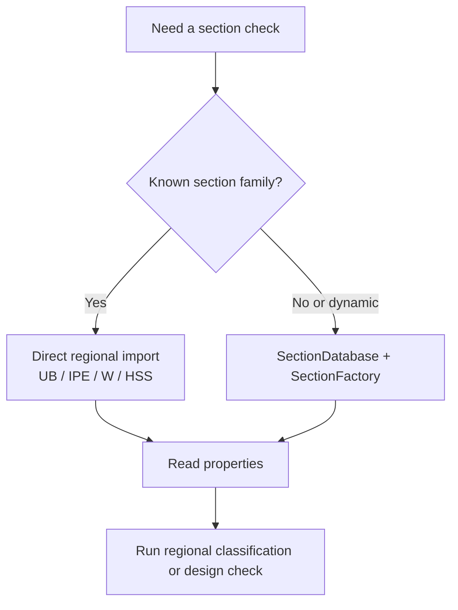

# Engineering Workflow

This guide is for a structural engineer using the app **as it exists today**.

It focuses on practical use, not on a future simplified API.

## The shortest useful mental model

You normally do one of these two things:

- **direct section workflow** for quick checks
- **database/factory workflow** for automation



## Workflow 1: quick direct use

Use this when you already know the section family.

```python
from steelsnakes.UK import UB, StressPattern, classify_section

section = UB("457x191x67")
print(section.h)
print(section.get_properties())

result = classify_section(
    section=section,
    fy_mpa=355.0,
    stress_pattern=StressPattern.MAJOR_AXIS_BENDING,
)
print(result.section_class)
```

## Workflow 2: dynamic lookup from external data

Use this when designations come from Excel, CSV, databases, or user input.

```python
from steelsnakes.base.database import SectionDatabase
from steelsnakes.base.factory import SectionFactory
from steelsnakes.base.sections import SectionType
from steelsnakes.UK import classify_section

# Load and search
uk_db = SectionDatabase(region="UK")
uk_factory = SectionFactory(database=uk_db)

section = uk_factory.create_section(
    designation="457x191x67",
    section_type=SectionType.UB,
)

# Then run checks
result = classify_section(section=section, fy_mpa=355.0)
print(result.section_class)
```

## What the package is best at today

### 1. Section catalog access

Treat the library as a programmable steel table.

### 2. Classification workflows

The most mature design-oriented workflows in the docs are classification workflows, especially:

- `EU`
- `UK`
- `US`

### 3. Scriptable engineering tools

The current architecture is well suited to:

- office scripts
- engineering notebooks
- internal web tools
- spreadsheet-backed automation

## How to think about the architecture

A practical way to explain the app is:

\[
\text{engineering result} = \text{check}(\text{section geometry},\, \text{material strength},\, \text{design context})
\]

and `steelsnakes` helps by giving you the section geometry in a structured way.

## Choosing the right entry point

| If you want to... | Start here |
|---|---|
| inspect section properties quickly | direct regional import |
| search a section database | `SectionDatabase` |
| create typed section objects dynamically | `SectionFactory` |
| classify an EC3 section | `steelsnakes.EU` or `steelsnakes.UK` |
| classify an AISC section | `steelsnakes.US` |

## Present limitations to keep in mind

/// card | Important
- Unit handling is still your responsibility.
- Coverage varies by region and shape family.
- Some APIs are engineering-useful but not yet polished as a final public API.
///

## Recommended reading order

1. **First Steps** for installation and basic property access
2. **Section Database & Factory** for architecture and automation
3. **UK / US / EU classification** pages for design workflows
