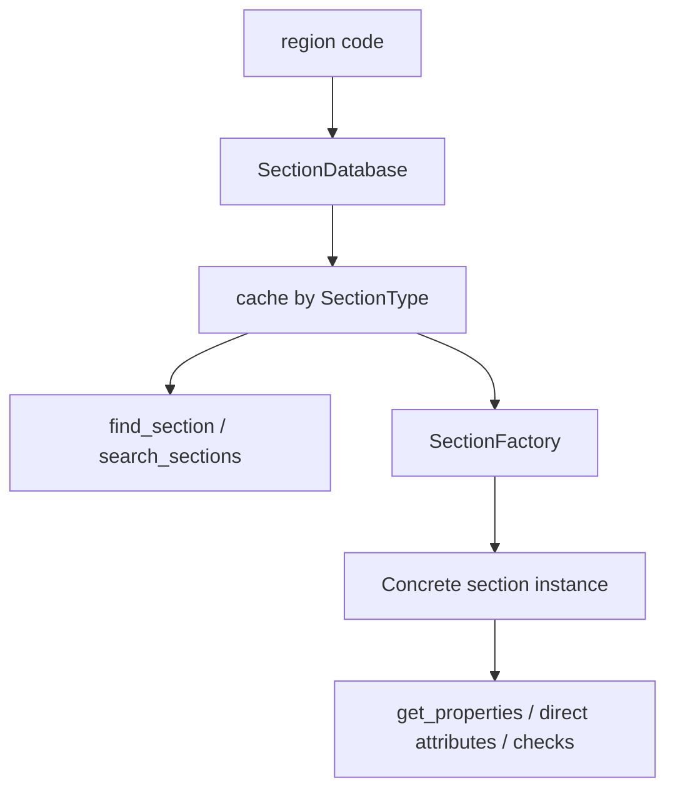

# Section Database & Factory

This is the backbone of the app.

If you are writing scripts, notebooks, or internal tools, this is usually the most important part of the current architecture.

## Architecture in one diagram



## `SectionDatabase`

`SectionDatabase` does three jobs:

1. **find the regional data folder**
2. **load section tables into memory**
3. **help you search by designation or filters**

### Why it matters

For an engineer, this means you can treat the package like a searchable section catalogue before you even create a section object.

### Typical flow

```python
from steelsnakes.base.database import SectionDatabase

db = SectionDatabase(region="UK")
match = db.find_section("457x191x67")
print(match)
```

### Search strategy

The lookup behavior is intentionally forgiving:

- exact designation first
- then normalized matching
- then fuzzy similarity matching

That is useful when incoming labels vary slightly between spreadsheets, analysis exports, and hand-entered names.

## `SectionFactory`

`SectionFactory` converts cached data into the right regional section class.

### Why it matters

This is what lets you move from **catalogue data** to an **object you can interrogate or classify**.

```python
from steelsnakes.base.database import SectionDatabase
from steelsnakes.base.factory import SectionFactory
from steelsnakes.base.sections import SectionType

# 1. Load a regional catalogue
uk_db = SectionDatabase(region="UK")

# 2. Build a factory for that catalogue
uk_factory = SectionFactory(database=uk_db)

# 3. Create a typed section object
section = uk_factory.create_section("457x191x67", section_type=SectionType.UB)

print(section)
print(section.get_properties())
```

## Practical engineering use

Use the database/factory layer when you need to:

- build a quick section browser
- validate designations coming from Excel or CSV
- compare candidate sections with simple filters
- pass real section objects into classification functions

## Architectural idea

The current architecture is simple enough to explain as:

\[
\text{section object} = \text{factory}(\text{database}(\text{region data}))
\]

That may look abstract, but in practice it keeps responsibilities separate:

- data loading stays in one place
- region-specific shape classes stay in one place
- design checks stay in one place

## When to use this layer vs direct regional imports

| Use case | Best approach |
|---|---|
| You already know the exact class, e.g. `UB` or `W` | Import directly from the region package |
| You are building a tool that must work from designations dynamically | Use `SectionDatabase` + `SectionFactory` |
| You need robust lookup from inconsistent names | Start with `SectionDatabase` |
| You want classification after lookup | Database → Factory → Check |

## Minimal rule of thumb

/// card | Recommended pattern
For exploratory engineering work:

1. use a **regional direct import** for quick one-off checks
2. use **database + factory** for automation or apps
///
