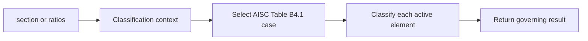

# US Classification

This page documents the current AISC classification surface in `steelsnakes.US`.

The goal here is not to mirror every function in prose. The goal is to make the structure easy to use.

## What the module does

The US classification module evaluates local slenderness / compactness style limits for the relevant compression elements.

In practice, the workflow is:



## Core idea

In the US implementation, the starting point is usually the **classification context**.

That context decides which element is active and which case is checked.

So the mental model is:

\[
\text{result} = f(\text{context},\, \lambda,\, F_y,\, E,\, \text{case metadata})
\]

where \(\lambda\) is the relevant slenderness ratio for the active plate or wall.

## Use the API at three levels

### 1. Fast section-level check

Use this when you already have a `steelsnakes.US` section object.

```python
from steelsnakes.US.checks import classify_section, ClassificationContext

result = classify_section(
    section=section,
    context=ClassificationContext.COMPRESSION,
    Fy=50.0,
)
```

### 2. Dictionary-based check

Use this for API payloads, spreadsheets, or serializers.

```python
from steelsnakes.US.checks import classify_section_from_dict

result = classify_section_from_dict(
    data=section_data,
    context="compression",
    Fy=50.0,
)
```

### 3. Direct case check

Use this when you need exact control over the AISC table case.

```python
from steelsnakes.US.checks import classify_compression, CompressionCase

result = classify_compression(
    CompressionCase.CASE_1,
    ratio=38.2,
    Fy=50.0,
    E=29000.0,
)
```

## Which objects matter most

| Object | Use it for |
|---|---|
| `ClassificationContext` | Tell the module what design situation you are checking |
| `CompressionCase`, `FlexureCase` | Force a specific AISC case |
| `ElementInput` | Provide explicit element-level inputs |
| `ClassificationResult` | Read the governing section/element result |

## Recommended usage for engineers

- Use **section-level classification** first.
- Drop to **dictionary input** when integrating with external data.
- Drop to **direct case functions** only when you are validating edge cases or building your own adapter.

## Scope note

The API is already useful, but some cases are exposed sooner at the direct-case level than at the high-level adapter level.

That is a normal consequence of the current architecture and is acceptable for an engineering-first release.

## API objects

::: steelsnakes.US.checks.classification.StressPattern

::: steelsnakes.US.checks.classification.ClassificationContext

::: steelsnakes.US.checks.classification.CompressionCase

::: steelsnakes.US.checks.classification.FlexureCase

::: steelsnakes.US.checks.classification.ElementInput

::: steelsnakes.US.checks.classification.ElementClassification

::: steelsnakes.US.checks.classification.ClassificationResult

::: steelsnakes.US.checks.classification.classify_compression

::: steelsnakes.US.checks.classification.classify_flexure

::: steelsnakes.US.checks.classification.classify_element

::: steelsnakes.US.checks.classification.classify_elements

::: steelsnakes.US.checks.classification.classify_section

::: steelsnakes.US.checks.classification.classify_section_from_dict
