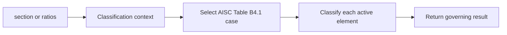

# US Classification

This page documents the current AISC classification surface in `steelsnakes.US`.

The goal here is not to mirror every function in prose. The goal is to make the structure easy to use.

## What the module does

The US classification module evaluates local slenderness / compactness style limits for the relevant compression elements.

In practice, the workflow is:


```mermaid
flowchart LR
    A[section or ratios] --> B[Classification context]
    B --> C[Select AISC Table B4.1 case]
    C --> D[Classify each active element]
    D --> E[Return governing result]
```

## Core idea

In the US implementation, the starting point is usually the **classification context**.

That context decides which element is active and which case is checked.

So the mental model is:

\[
\text{result} = f(\text{context},\, \lambda,\, F_y,\, E,\, \text{case metadata})
\]

where \(\lambda\) is the relevant slenderness ratio for the active plate or wall.

## Use the API at three levels

### 1. Fast section-level check

Use this when you already have a `steelsnakes.US` section object.

```python
from steelsnakes.US.checks import classify_section, ClassificationContext
from steelsnakes.US.sections.beams import W_beam

result = classify_section(
    section=W_beam("W14X90"),
    Fy_ksi=50.0,
    classification_context=ClassificationContext.FLEXURE_MAJOR_AXIS,
)
print(result.section_class, result.governing_elements)  # NONCOMPACT ['flange']; User Note F2
```

### 2. Dictionary-based check

Use this for API payloads, spreadsheets, or serializers.

```python
from steelsnakes.US.checks import classify_section_from_dict
from steelsnakes.base.sections import SectionType

result = classify_section_from_dict(
    SectionType.HSS_RCT,
    {"h_tdes": 22.8, "b_tdes": 14.2, "tdes": 0.465},
    Fy_ksi=50.0,
    classification_context="axial_compression",
)
```

### 3. Direct case check

Use this when you need exact control over the AISC table case.

```python
from steelsnakes.US.checks import classify_compression, classify_flexure, CompressionCase, FlexureCase

result = classify_compression(CompressionCase.CASE_1, wttr=10.2, Fy=50.0, E=29000.0)

# Case 16, webs of singly symmetric I-shapes: lambda_p from hc/hp and Mp/My
web = classify_flexure(FlexureCase.CASE_16, E=29000.0, Fy=50.0, hc=40.0, tw=0.35, hp=30.0, Mp=12500.0, My=7500.0)
```

`wttr` is the width-to-thickness ratio; alternatively pass the dimensions the case uses, e.g `b` and `t`, `h` and `tw`,
`D` and `t`. Cases 2 and 11 also need `kc` (or `h` and `tw`), and case 11 needs `Fl` or `web_is_slender`.

## Coverage by section type

Each element is checked against the Table B4.1a case (axial compression) or the Table B4.1b case (flexure) below;
the section takes the class of its most slender element.

| Section | Axial compression (B4.1a) | Major-axis flexure (B4.1b) | Minor-axis flexure (B4.1b) |
|---|---|---|---|
| W, S, M, HP | web 5, flange 1 | web 15, flange 10 | flange 13 (F6) |
| C, MC | web 5, flange 1 | web 15, flange 10 | flange 13 (F6) |
| WT, ST, MT | stem 4, flange 1 | stem 14, flange 10 | not applicable; F9 is for the plane of symmetry |
| L | legs 3 | legs 12 (F10) | legs 12 (F10) |
| 2L | legs 3 (1 for legs in continuous contact) | legs 12 (F9.3(b), F9.4(b)) | not applicable |
| HSS rectangular and square | walls 6 | web (h) 19, flange (b) 17 | web (b) 19, flange (h) 17 |
| HSS round, Pipe | wall 9 | wall 20 | wall 20 |
| Built-up, via `ElementInput` | flanges 2 (kc) | flanges 11 (kc, FL), singly symmetric web 16 | |

Built-up elements carry their extra inputs in `ElementInput.metadata`, e.g `{"kc": 0.5}` for cases 2 and 11, or
`{"hc_hp": 1.33, "Mp_My": 1.67}` for case 16.

## Which objects matter most

| Object | Use it for |
|---|---|
| `ClassificationContext` | Tell the module what design situation you are checking |
| `CompressionCase`, `FlexureCase` | Force a specific AISC case |
| `ElementInput` | Provide explicit element-level inputs |
| `ClassificationResult` | Read the governing section/element result |

## Recommended usage for engineers

- Use **section-level classification** first.
- Drop to **dictionary input** when integrating with external data.
- Drop to **direct case functions** only when you are validating edge cases or building your own adapter.

## Scope note

Built-up sections have no section tables, so cases 2, 7, 11, 16, 18 and 21 are reached through `ElementInput` or the
direct case functions. For SI units on the US_Metric sections, use `steelsnakes.US_Metric.classify_section()`, which
takes `Fy_MPa` and `E_MPa` and reports them on its result.

## API objects

::: steelsnakes.US.checks.classification.StressPattern

::: steelsnakes.US.checks.classification.ClassificationContext

::: steelsnakes.US.checks.classification.CompressionCase

::: steelsnakes.US.checks.classification.FlexureCase

::: steelsnakes.US.checks.classification.ElementInput

::: steelsnakes.US.checks.classification.ElementClassification

::: steelsnakes.US.checks.classification.ClassificationResult

::: steelsnakes.US.checks.classification.classify_compression

::: steelsnakes.US.checks.classification.classify_flexure

::: steelsnakes.US.checks.classification.classify_element

::: steelsnakes.US.checks.classification.classify_elements

::: steelsnakes.US.checks.classification.classify_section

::: steelsnakes.US.checks.classification.classify_section_from_dict
