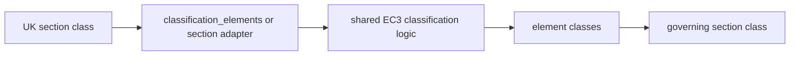

# UK Classification

This page documents the current UK classification surface in `steelsnakes.UK`.

The UK package is best understood as a **regional adapter over the shared EC3-style engine**.

## Architecture in one view



## Design idea

The formula logic stays centralized, while the UK package supplies the section families and public entry points engineers actually want to import.

That makes the current architecture:

- easier to extend
- easier to test
- easier to keep aligned with the EU implementation

## What to use first

### 1. Standard section check

```python
from steelsnakes.UK import UB, StressPattern, classify_section

section = UB("457x191x67")
result = classify_section(
    section=section,
    fy_mpa=355.0,
    stress_pattern=StressPattern.MAJOR_AXIS_BENDING,
)

print(result.section_class)
```

### 2. Hollow section check

```python
from steelsnakes.UK import HFRHS, classify_section

section = HFRHS("50x30x3.2")
result = classify_section(section=section, fy_mpa=355.0)

print(result.section_class)
```

### 3. Explicit element-level control

Use `custom_elements` when you want to control the stress state directly.

```python
from steelsnakes.UK import ElementInput, ElementStressCase, classify_section

result = classify_section(
    fy_mpa=355.0,
    custom_elements=[
        ElementInput(
            name="web",
            kind="internal",
            c_mm=360.4,
            t_mm=7.7,
            stress=ElementStressCase.COMBINED,
            alpha=0.70,
        )
    ],
)
```

## Engineering interpretation

For a structural engineer, the useful pattern is:

1. instantiate a UK section
2. pick the stress pattern that matches the design situation
3. read the governing element class

In compact notation:

\[
\text{section class} = \max\left(\text{element classes derived from Table 5.2 logic}\right)
\]

where “max” means the most restrictive class governs.

## Supported shape families

| Family | Status | Note |
|---|---|---|
| `UB`, `UC`, `UBP` | Supported | Main I/H section workflow |
| `PFC` | Supported | Channel workflow |
| Angles | Supported | Compression-oriented use cases are in place |
| `HFRHS`, `HFSHS`, `HFCHS` | Supported | Hot-finished hollow sections |
| `CFRHS`, `CFSHS`, `CFCHS` | Supported | Shared engine, with explicit Class 4 exits |
| `HFEHS` | Deferred | No implemented Table 5.2 path yet |

## Recommended usage for engineers

/// card | Recommended order
1. Use `classify_section(...)` for normal work.
2. Use `StressPattern` presets for common beam/column situations.
3. Use `custom_elements` only when you need explicit stress control.
///

## API objects

::: steelsnakes.UK.checks.classification.StressPattern

::: steelsnakes.UK.checks.classification.ElementStressCase

::: steelsnakes.UK.checks.classification.ElementInput

::: steelsnakes.UK.checks.classification.ElementClassification

::: steelsnakes.UK.checks.classification.ClassificationResult

::: steelsnakes.UK.checks.classification.classify_circular_hollow

::: steelsnakes.UK.checks.classification.classify_element

::: steelsnakes.UK.checks.classification.classify_internal_part

::: steelsnakes.UK.checks.classification.classify_outstand_flange

::: steelsnakes.UK.checks.classification.classify_elements

::: steelsnakes.UK.checks.classification.classify_section

::: steelsnakes.UK.checks.classification.classify_section_from_dict
