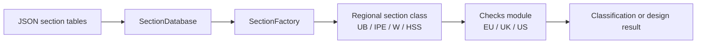

# API Reference

This reference is intentionally **lean**.

Use it to answer three questions quickly:

1. **Where does data come from?** `SectionDatabase`
2. **How do I get a section object?** `SectionFactory`
3. **Where do classification checks live?** Regional `checks` modules

/// card | Core architecture
`steelsnakes` currently has a practical internal architecture:

- **data files** hold section properties
- **database classes** load and search them
- **factory classes** build section objects
- **regional section classes** expose geometry/properties
- **regional checks** perform code-specific verification
///

## Mental model

## Package layout

| Layer | Main modules | Why it exists |
|---|---|---|
| Shared core | `steelsnakes.base.sections`, `steelsnakes.base.database`, `steelsnakes.base.factory` | Common section typing, data loading, lookup, and object creation |
| Regional data | `steelsnakes.<region>.data` | Region-specific section tables |
| Regional sections | `steelsnakes.<region>.sections` | Concrete classes such as `UB`, `UC`, `IPE`, `W`, `HSS` |
| Regional checks | `steelsnakes.EU.checks`, `steelsnakes.UK.checks`, `steelsnakes.US.checks` | Code-specific classification and design helpers |

## What to read next

- **Section Database & Factory** if you are automating section lookup, data access, or object creation.
- **UK Classification** if you are using EC3-style classification through the UK package.
- **US Classification** if you are using AISC local slenderness / compactness checks.

## Current public API stance

The current API is best understood as a **working engineering API**, not yet a final polished public interface.

That means:

- the **architecture is already useful** for scripts and engineering workflows
- the **classification entry points are usable today**
- a simpler, more unified public API can still be added later without losing the current structure

A good rule is:

\[
\text{workflow today} = \text{data access} + \text{section object} + \text{regional check}
\]

That is the pattern this documentation now emphasizes.
