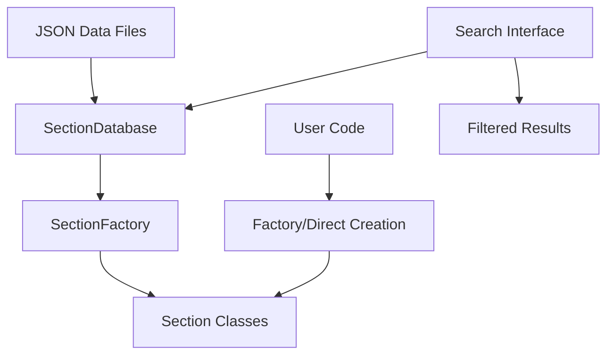

# API Documentation

Welcome to the SteelSnakes API documentation. This section provides comprehensive reference material for all classes, functions, and modules in the library.

## Quick Navigation

### Core Components
- **[Core API](reference/core.md)** - Base classes, database, and factory
- **[Sections API](reference/sections.md)** - All steel section types
- **[Database API](reference/database.md)** - Database system details

### Usage Guides
- **[Getting Started](getting-started/installation.md)** - Installation and setup
- **[User Guide](user-guide/section-types.md)** - Feature documentation
- **[Examples](examples/basic.md)** - Practical examples

## Architecture Overview



SteelSnakes is built around three main architectural components:

1. **Section Classes** - Type-safe representations of steel sections
2. **Database System** - Unified storage and search for all section data  
3. **Factory Pattern** - Automatic section type detection and creation

## Common Usage Patterns

### Direct Section Creation
```python
from steelsnakes.core.sections.UK import UB, UC, PFC

beam = UB("457x191x67")
column = UC("305x305x137")
channel = PFC("430x100x64")
```

### Factory-based Creation
```python
from steelsnakes.core.sections.UK import get_factory

factory = get_factory()
section = factory.create_section("457x191x67")  # Auto-detects as UB
```

### Database Search
```python
from steelsnakes.core.sections.UK import get_database, SectionType

database = get_database()
heavy_beams = database.search_sections(SectionType.UB, mass_per_metre__gt=100)
```

## Type System

SteelSnakes uses Python's type system extensively:

- **Type Hints** - All public APIs have comprehensive type annotations
- **Pydantic Models** - Runtime validation and serialization
- **Enums** - Type-safe section type identification
- **Dataclasses** - Efficient, immutable section objects

This ensures that errors are caught early and IDE support is excellent.

## Standards Compliance

All section data conforms to:
- **BS EN 10365** - Hot rolled steel sections
- **BS EN 1993** - Eurocode 3 design standards
- **UK Steel Industry Standards** - Current UK practice

## Next Steps

Choose your starting point:

- **New to SteelSnakes?** Start with [Installation](getting-started/installation.md)
- **Want examples?** Check out [Basic Examples](examples/basic.md)
- **Need specific API details?** Browse the [API Reference](reference/core.md)
- **Contributing?** See [Development Guide](contributing/development.md)
