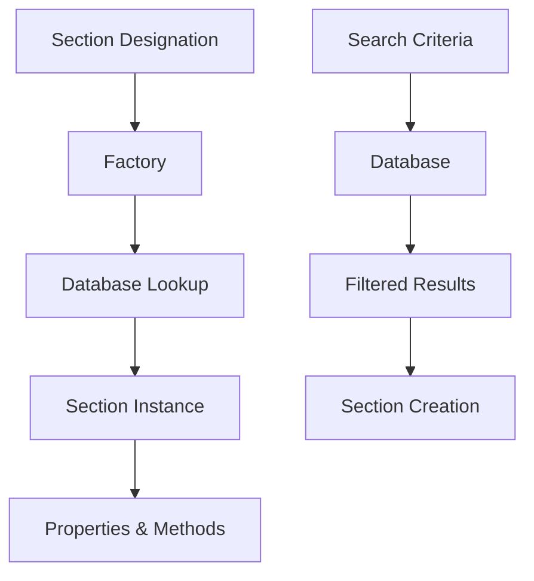

# Basic Usage

This guide covers the fundamental concepts and usage patterns in SteelSnakes. After reading this, you'll understand the core architecture and be able to use the library effectively.

## Core Architecture

SteelSnakes is built around three main components:

1. **Section Classes** - Type-safe representations of steel sections
2. **Database System** - Unified storage and search for all section data
3. **Factory Pattern** - Automatic section type detection and creation



## Section Classes

All steel sections inherit from `BaseSection` and provide a consistent interface:

```python
from steelsnakes.core.sections.UK import UB, UC, PFC

# All sections work the same way
sections = [
    UB("457x191x67"),      # Universal Beam
    UC("305x305x137"),     # Universal Column  
    PFC("430x100x64")      # Parallel Flange Channel
]

# Common interface for all sections
for section in sections:
    print(f"Section: {section.designation}")
    print(f"Type: {section.get_section_type().value}")
    print(f"Mass: {section.mass_per_metre} kg/m")
    print(f"Area: {section.A} cm²")
    print("-" * 30)
```

### Section Properties

Each section type has properties specific to its geometry, but common properties are available across all types:

#### Universal Properties

```python
beam = UB("457x191x67")

# Always available
print(f"Designation: {beam.designation}")
print(f"Mass per metre: {beam.mass_per_metre} kg/m")
print(f"Cross-sectional area: {beam.A} cm²")

# Section type specific
print(f"Height: {beam.h} mm")
print(f"Width: {beam.b} mm") 
print(f"Web thickness: {beam.t_w} mm")
print(f"Flange thickness: {beam.t_f} mm")
```

#### Property Categories

| Category | Properties | Example |
|----------|------------|---------|
| **Geometric** | `h`, `b`, `t_w`, `t_f`, `r` | Dimensions and radii |
| **Cross-Section** | `A`, `A_v`, `A_w` | Areas for analysis |
| **Moment of Inertia** | `I_yy`, `I_zz`, `I_w` | Second moments |
| **Section Modulus** | `W_el_y`, `W_el_z`, `W_pl_y`, `W_pl_z` | Elastic and plastic |
| **Radius of Gyration** | `i_y`, `i_z` | Buckling analysis |
| **Mass** | `mass_per_metre` | Weight calculations |

## Database System

The database provides unified access to all section data with powerful search capabilities:

### Basic Database Operations

```python
from steelsnakes.core.sections.UK import get_database, SectionType

database = get_database()

# Get available section types
available_types = database.get_available_types()
print(f"Available types: {[t.value for t in available_types]}")

# List all sections of a type
all_beams = database.list_sections(SectionType.UB)
print(f"Total UB sections: {len(all_beams)}")

# Get specific section data
section_data = database.get_section_data(SectionType.UB, "457x191x67")
print(f"Section data keys: {list(section_data.keys())}")
```

### Search Operations

The database supports sophisticated search with comparison operators:

#### Comparison Operators

| Operator | Meaning | Example |
|----------|---------|---------|
| `__gt` | Greater than | `mass_per_metre__gt=50` |
| `__lt` | Less than | `h__lt=400` |
| `__gte` | Greater than or equal | `I_yy__gte=10000` |
| `__lte` | Less than or equal | `b__lte=200` |
| `__eq` | Equal to | `t_f__eq=12.7` |
| `__ne` | Not equal to | `r__ne=10.2` |

#### Search Examples

```python
# Find heavy beams
heavy_beams = database.search_sections(
    SectionType.UB,
    mass_per_metre__gt=100
)

# Find compact channels (depth < 300mm, width > 80mm)
compact_channels = database.search_sections(
    SectionType.PFC,
    h__lt=300,
    b__gt=80
)

# Find sections with specific flange thickness
thick_flange_beams = database.search_sections(
    SectionType.UB,
    t_f__gte=15.0
)

print(f"Heavy beams: {len(heavy_beams)}")
print(f"Compact channels: {len(compact_channels)}")
print(f"Thick flange beams: {len(thick_flange_beams)}")
```

#### Complex Searches

Combine multiple criteria for precise filtering:

```python
# Find medium-weight, deep beams suitable for long spans
suitable_beams = database.search_sections(
    SectionType.UB,
    h__gte=450,           # Deep sections
    h__lte=600,           # But not too deep
    mass_per_metre__gt=60, # Reasonable weight
    mass_per_metre__lt=120,
    I_yy__gt=30000        # High moment of inertia
)

print(f"Found {len(suitable_beams)} suitable beams:")
for designation, data in suitable_beams[:5]:
    print(f"  {designation}: {data['mass_per_metre']} kg/m, I_yy={data['I_yy']} cm⁴")
```

## Factory Pattern

The factory provides automatic section type detection and creation:

### Auto-Detection

```python
from steelsnakes.core.sections.UK import get_factory

factory = get_factory()

# Factory automatically detects section types
designations = [
    "457x191x67",    # UB
    "305x305x137",   # UC  
    "430x100x64",    # PFC
    "200x200x24.0",  # L_EQUAL
    "48.3x4.0"       # CFCHS
]

for designation in designations:
    section = factory.create_section(designation)
    section_type = section.get_section_type()
    print(f"{designation:15} → {section_type.value}")
```

### Explicit Type Specification

Sometimes you want to be explicit about the section type:

```python
from steelsnakes.core.sections.UK import get_factory, SectionType

factory = get_factory()

# Force specific section type
beam = factory.create_section("457x191x67", SectionType.UB)
column = factory.create_section("305x305x137", SectionType.UC)

print(f"Beam: {beam} ({beam.get_section_type().value})")
print(f"Column: {column} ({column.get_section_type().value})")
```

## Error Handling

SteelSnakes provides clear error messages for common issues:

```python
from steelsnakes.core.sections.UK import UB, get_database, SectionType

# Invalid designation
try:
    invalid_beam = UB("999x999x999")
except ValueError as e:
    print(f"Error: {e}")

# Section not found in database
try:
    database = get_database()
    data = database.get_section_data(SectionType.UB, "nonexistent")
    if not data:
        print("Section not found in database")
except Exception as e:
    print(f"Database error: {e}")
```

## Performance Considerations

### Lazy Loading

SteelSnakes uses lazy loading for optimal performance:

```python
# Database is loaded once and cached
database = get_database()  # Fast after first call

# Section creation is fast
beam = UB("457x191x67")    # Quick lookup from cached data
```

### Memory Usage

The library is designed for efficiency:

```python
import sys
from steelsnakes.core.sections.UK import get_database

database = get_database()
print(f"Database object size: {sys.getsizeof(database)} bytes")

# Sections are lightweight
beam = UB("457x191x67")
print(f"Section object size: {sys.getsizeof(beam)} bytes")
```

## Best Practices

### 1. Use Type Hints

```python
from steelsnakes.core.sections.UK import UB, BaseSection
from typing import List

def analyze_beams(beam_designations: List[str]) -> List[BaseSection]:
    """Analyze a list of beam designations."""
    return [UB(designation) for designation in beam_designations]
```

### 2. Cache Database Instance

```python
from steelsnakes.core.sections.UK import get_database

# Cache the database for repeated use
class SteelDesign:
    def __init__(self):
        self.database = get_database()
    
    def find_beams(self, criteria):
        return self.database.search_sections(SectionType.UB, **criteria)
```

### 3. Handle Missing Sections Gracefully

```python
def safe_section_creation(designation: str) -> Optional[BaseSection]:
    """Safely create a section, returning None if not found."""
    try:
        factory = get_factory()
        return factory.create_section(designation)
    except ValueError:
        return None
```

### 4. Use Meaningful Variable Names

```python
# Good
primary_beam = UB("457x191x67")
secondary_beam = UB("305x165x40")

# Better
main_span_beam = UB("457x191x67")
cantilever_beam = UB("305x165x40")
```

## Common Workflows

### Design Workflow

```python
from steelsnakes.core.sections.UK import get_database, SectionType

def select_beam_for_span(span_m: float, load_kn_m: float) -> tuple:
    """Select appropriate beam for given span and load."""
    database = get_database()
    
    # Calculate required section modulus (simplified)
    required_w = (load_kn_m * span_m**2 * 1000) / (8 * 165)  # cm³
    
    # Find suitable beams
    candidates = database.search_sections(
        SectionType.UB,
        W_el_y__gte=required_w
    )
    
    # Sort by mass (lightest first)
    candidates.sort(key=lambda x: x[1]['mass_per_metre'])
    
    if candidates:
        designation, data = candidates[0]
        return designation, data['mass_per_metre']
    else:
        return None, None

# Example usage
beam_designation, mass = select_beam_for_span(8.0, 25.0)
if beam_designation:
    print(f"Selected beam: {beam_designation} ({mass} kg/m)")
```

### Analysis Workflow

```python
def compare_section_efficiency(designations: List[str]) -> None:
    """Compare structural efficiency of different sections."""
    sections = [UB(d) for d in designations]
    
    print(f"{'Designation':15} {'Mass':>8} {'I_yy':>10} {'Efficiency':>12}")
    print("-" * 50)
    
    for section in sections:
        efficiency = section.I_yy / section.mass_per_metre
        print(f"{section.designation:15} "
              f"{section.mass_per_metre:8.1f} "
              f"{section.I_yy:10.0f} "
              f"{efficiency:12.1f}")

# Compare beam options
beam_options = ["406x178x54", "457x191x67", "533x210x82"]
compare_section_efficiency(beam_options)
```

## Next Steps

Now that you understand the basics:

1. **[Section Types](../user-guide/section-types.md)** - Learn about all 18 section types
2. **[Advanced Search](../user-guide/search.md)** - Master database search capabilities  
3. **[Examples](../examples/basic.md)** - See real-world usage examples
4. **[API Reference](../reference/core.md)** - Detailed API documentation

!!! tip "Interactive Learning"
    The best way to learn SteelSnakes is to experiment in a Jupyter notebook or Python REPL. All methods and properties have comprehensive docstrings and type hints.
