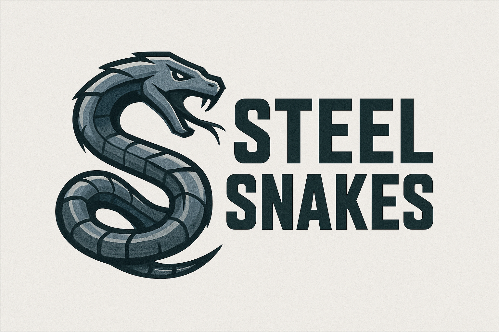

# `SteelSnakes`

<!-- Centered HTML-image logo -->


<div align="center">
  <p>
    <a href="https://python.org"></a>
    <a href="./LICENSE.md"></a>
    <a href="https://pypi.org/project/steelsnakes/"></a>
    <a href="https://steelsnakes.readthedocs.io/"></a>
    <!-- <a href="#"> -->
  </p>
</div>

A Python library for structural steel.
Currently supports 🇬🇧 UK, 🇪🇺 EU, 🇺🇸 US.Developing 🇮🇳 IS. Considering 🇦🇺 AU / 🇳🇿 NZ, 🇯🇵 JP, 🇲🇽 MX, 🇿🇦 SA, 🇨🇳 CN, 🇨🇦 CA, 🇰🇷 KR.


## Quick Start

### Installation

```bash
pip install steelsnakes
```

### Basic Usage

```python
from steelsnakes.UK import UB, UC, PFC

# Create section objects using the designations
beam = UB("457x191x67") # Universal Beam
column = UC("305x305x137") # Universal Column
channel = PFC("430x100x64") # Parallel Flange Channel

# Access properties immediately
print(f"Beam moment of inertia: {beam.I_yy} cm⁴")
print(f"Column mass: {column.mass_per_metre} kg/m")
print(f"Channel shear center: {channel.e0} mm")
```

## Documentation

- **[Installation Guide](https://steelsnakes.readthedocs.io/getting-started/installation/)** - Get started quickly
- **[User Guide](https://steelsnakes.readthedocs.io/user-guide/section-types/)** - Comprehensive feature documentation
- **[Examples](https://steelsnakes.readthedocs.io/examples/basic/)** - Practical usage examples
- **[API Reference](https://steelsnakes.readthedocs.io/reference/core/)** - Complete API documentation


## Contributing

We welcome contributions! Please see our [Contributing Guidelines](https://steelsnakes.readthedocs.io/contributing/guidelines/) for details.

## License

This project is licensed under the GNU General Public License v2.0. See the [LICENSE]([https://github.com/waynemaranga/steelsnakes/blob/main/LICENSE.md) file for details.

## Acknowledgments

- SCI (Steel Construction Institute)
- ArcelorMittal
- AISC (American Institute of Steel Construction)
- ****