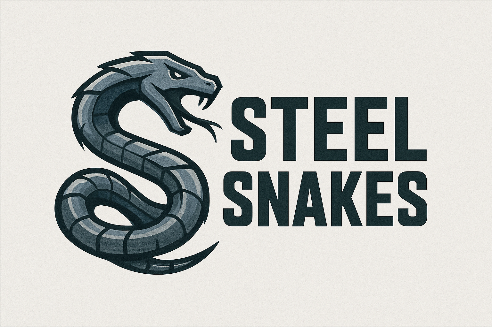

# $steelsnakes$



<div align="center">
  <p>
    <a href="https://python.org"></a> <a href="./LICENSE.md"></a> <a href="https://pypi.org/project/steelsnakes/"></a> <a href="https://steelsnakes.readthedocs.io/"></a>
    <!-- <a href="#"> -->
  </p>
</div>

A python package for structural steel design. $steelsnakes$ aims to provide a unified interface for designing steel members and connections for civil & structural engineers using Python. Users can import steel section data from international standards, perform verification checks from prior analysis and more.

<!-- prettier-ignore-start -->
!!! warning "Work in Progress"
$steelsnakes$ is currently under active development. Please report any issues or feature requests on the GitHub [ISSUES](https://github.com/waynemaranga/steelsnakes/issues) page.
<!-- prettier-ignore-end -->

## Latest Progress (March 21, 2026)

- `SectionDatabase` now auto-discovers regional JSON files, keeps the cache keyed by `SectionType`, and exposes both fuzzy lookups and comparison-based search helpers so you can handle designations that vary in case, hyphenation, or separator characters.
- `SectionFactory` wires that cache to concrete section classes for `UK`, `EU`, and `US` while gracefully warning when the region linked in `SectionDatabase` does not yet have a corresponding module; extension hooks for `AU`/`NZ` are already in place.
- Region coverage in this release: `UK`, `EU`, and `US` are the most mature, `IN` is under active proof-of-concept, and the pending list (`AU`, `NZ`, `JP`, `MX`, `SA`, `CN`, `CA`, `KR`) is closely tracked in the TBD section of the source documentation.
- Built-in checks in `src/steelsnakes/UK/checks/uls.py`, `stability.py`, `src/steelsnakes/US/checks/classification.py`, and `lrfd.py` already capture clauses for limit state verifications; expect more worked examples and metadata refinement as the TODO comments are closed.
- `EU` classification now supports lean stress-aware Eurocode checks for compression, major-axis bending presets, and explicit combined cases through Pydantic-friendly inputs; see `01-guides/05-eu-classification.md`.
- The MkDocs API reference now starts with dedicated pages for the shared base modules (`sections`, `database`, `factory`, `checks`) before branching into each region; see `02-api-reference/index.md` and the new `02-api-reference/02-database.md` deep dive for details.

<!-- prettier-ignore-start -->
!!! warning "Note"
    These capabilities are still evolving; metadata gaps, non-unit-aware helpers, and TODOs remain in the source. Double-check the implementation against the codebase whenever you need precise behavior, especially before using it in production.
<!-- prettier-ignore-end -->

$steelsnakes$ is divided into `regions`, and is currently developing support for the following regional standards:

1. 🇪🇺 `EU` European Union - Eurocode 3
2. 🇬🇧 `UK` United Kingdom - Eurocode 3 with UK NA (Heavily considering BS 5950 due to common use and redundancy of 2 Eurocode checks)
3. 🇺🇸 `US` United States - AISC & ASTM, under `US` for imperial units and `US_Metric` for SI units.
4. 🇮🇳 `IN` India - IS 800 & IS 808
5. 🇦🇺 `AU` Australia - AS 4100 & AS/NZS 5131
6. 🇳🇿 `NZ` New Zealand - NZS 3404 & AS/NZS 5131

See the [Codes and Standards](01-guides/03-codesandstds.md) guide for more information. <!-- TODO: check deployment and see if mkdocs+mkdocs-shadcn supports simple relative links -->

## Quick Start

### Installation

<!-- prettier-ignore-start -->
/// tab | pip

    :::bash
    pip install steelsnakes
///

/// tab | uv

    :::bash
    uv add steelsnakes
///

/// tab | poetry

    :::bash
    poetry add steelsnakes
///
<!-- prettier-ignore-end -->

## Example

For available steel profiles implemented in $steelsnakes$, properties can be accessed directly from the object.
See the [Profiles](02-api-reference/02-database.md) for all available steel profiles.

```python
from steelsnakes.UK.universal import UB, UniversalBeam
from steelsnakes.US.beams import W, WideFlangeBeam

beam_1 = UB(designation="1016x305x438")
beam_2 = W("W44X335")

print(beam_1.h)
print(beam_2.d)
print(beam_2.A)
```

```text
1026.0
44.0
98.5
```

<!-- prettier-ignore-start -->
!!!warning "Note"
    $steelsnakes$ does not currently implement any units or unit conversion; it is up to the user to ensure that all inputs are in the correct units as required by calculations
<!-- prettier-ignore-end -->

## Contributing

All contributions are welcome! See the [CONTRIBUTING GUIDELINES](https://github.com/waynemaranga/steelsnakes/blob/main/CONTRIBUTING.md).

## License

This project is licensed under the GNU General Public License v2.0. See the [LICENSE](https://github.com/waynemaranga/steelsnakes/blob/main/LICENSE.md).

## References

See [References](./99-references.md)

## Acknowledgments

🫂
- SCI (Steel Construction Institute)
- ArcelorMittal
- AISC (American Institute of Steel Construction)
- SAISC (South African Institute of Steel Construction)

---


<!-- [1]: ...
[2]: ...

```

``` -->
