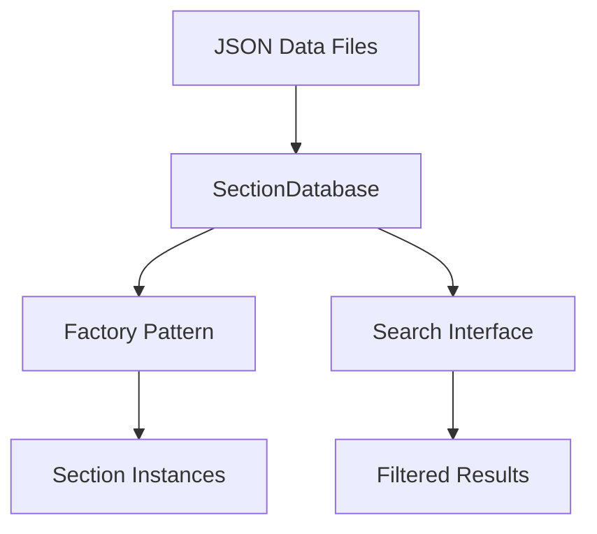

# Database System

The SteelSnakes database system provides unified access to all section data with powerful search and filtering capabilities. This guide covers the database architecture, search methods, and advanced usage patterns.

## Architecture Overview

The database system consists of three main components:



## SectionDatabase Class

The `SectionDatabase` class is the core of the data system, providing automatic loading and caching of all section types.

### Initialization

```python
from steelsnakes.core.sections.UK import get_database, SectionDatabase
from pathlib import Path

# Get the global database instance (recommended)
database = get_database()

# Or create a custom instance
custom_database = SectionDatabase(Path("custom/data/directory"))
```

### Data Loading

The database automatically discovers and loads all available section types:

```python
database = get_database()

# Check what was loaded
available_types = database.get_available_types()
print(f"Loaded types: {[t.value for t in available_types]}")

# Check counts for each type
for section_type in available_types:
    count = len(database.list_sections(section_type))
    print(f"{section_type.value}: {count} sections")
```

## Basic Operations

### Listing Sections

```python
from steelsnakes.core.sections.UK import get_database, SectionType

database = get_database()

# List all sections of a specific type
all_beams = database.list_sections(SectionType.UB)
print(f"Available UB sections: {len(all_beams)}")

# Show first few
for designation in all_beams[:10]:
    print(f"  {designation}")
```

### Getting Section Data

```python
# Get raw data for a specific section
section_data = database.get_section_data(SectionType.UB, "457x191x67")
if section_data:
    print(f"Properties: {list(section_data.keys())}")
    print(f"Mass: {section_data['mass_per_metre']} kg/m")
else:
    print("Section not found")
```

### Finding Sections

```python
# Find section across all types
result = database.find_section("457x191x67")
if result:
    section_type, data = result
    print(f"Found as {section_type.value}: {data['mass_per_metre']} kg/m")
```

## Search Operations

The database provides sophisticated search capabilities with comparison operators.

### Basic Search

```python
# Simple property matching
thick_beams = database.search_sections(
    SectionType.UB,
    t_f=16.0  # Exact match
)

print(f"Beams with 16mm flanges: {len(thick_beams)}")
```

### Comparison Operators

| Operator | Description | Example Usage |
|----------|-------------|---------------|
| `__gt` | Greater than | `mass_per_metre__gt=100` |
| `__lt` | Less than | `h__lt=400` |
| `__gte` | Greater than or equal | `I_yy__gte=10000` |
| `__lte` | Less than or equal | `b__lte=200` |
| `__eq` | Equal to | `t_f__eq=12.7` |
| `__ne` | Not equal to | `r__ne=10.2` |

```python
# Find heavy, deep beams
heavy_deep_beams = database.search_sections(
    SectionType.UB,
    mass_per_metre__gt=80,    # > 80 kg/m
    h__gte=450,               # >= 450mm deep
    h__lt=600                 # < 600mm deep
)

print(f"Heavy deep beams: {len(heavy_deep_beams)}")
```

### Complex Searches

Combine multiple criteria for precise filtering:

```python
# Find efficient beams for long spans
efficient_beams = database.search_sections(
    SectionType.UB,
    h__gte=400,               # Deep for stiffness
    mass_per_metre__lt=100,   # Not too heavy
    I_yy__gt=20000,          # High moment of inertia
    b__gte=150               # Wide flange for stability
)

# Sort by efficiency (I_yy/mass ratio)
efficient_beams.sort(
    key=lambda x: x[1]['I_yy'] / x[1]['mass_per_metre'], 
    reverse=True
)

print("Most efficient beams:")
for designation, data in efficient_beams[:5]:
    efficiency = data['I_yy'] / data['mass_per_metre']
    print(f"  {designation:15} - Efficiency: {efficiency:.1f} cm⁴/(kg/m)")
```

### Search by Multiple Properties

```python
# Channel search example
suitable_channels = database.search_sections(
    SectionType.PFC,
    h__gte=200,               # Minimum depth
    h__lte=400,               # Maximum depth
    b__gt=80,                 # Wide enough flange
    mass_per_metre__lt=50,    # Weight limit
    t_f__gte=10.0            # Minimum flange thickness
)

print(f"Suitable channels: {len(suitable_channels)}")
```

## Advanced Usage

### Custom Search Functions

Create reusable search functions for common criteria:

```python
def find_beams_for_span(span_m: float, load_kn_m: float) -> list:
    """Find suitable beams for given span and load."""
    database = get_database()
    
    # Calculate required section modulus (simplified)
    required_w = (load_kn_m * span_m**2 * 1000) / (8 * 165)  # cm³
    
    # Search for suitable beams
    candidates = database.search_sections(
        SectionType.UB,
        W_el_y__gte=required_w,
        h__lte=span_m * 1000 / 20  # Depth limit (span/20)
    )
    
    # Sort by mass (lightest first)
    candidates.sort(key=lambda x: x[1]['mass_per_metre'])
    
    return candidates

# Usage
suitable_beams = find_beams_for_span(8.0, 25.0)
if suitable_beams:
    designation, data = suitable_beams[0]
    print(f"Recommended beam: {designation} ({data['mass_per_metre']} kg/m)")
```

### Batch Searches

Perform multiple related searches efficiently:

```python
def section_summary(section_type: SectionType):
    """Generate summary statistics for a section type."""
    database = get_database()
    
    all_sections = database.search_sections(section_type)
    if not all_sections:
        return None
    
    masses = [data['mass_per_metre'] for _, data in all_sections]
    
    summary = {
        'count': len(all_sections),
        'mass_range': (min(masses), max(masses)),
        'average_mass': sum(masses) / len(masses)
    }
    
    # Add type-specific statistics
    if hasattr(all_sections[0][1], 'h'):
        heights = [data.get('h', 0) for _, data in all_sections if 'h' in data]
        if heights:
            summary['height_range'] = (min(heights), max(heights))
    
    return summary

# Generate summaries for all types
for section_type in [SectionType.UB, SectionType.UC, SectionType.PFC]:
    summary = section_summary(section_type)
    if summary:
        print(f"{section_type.value}:")
        print(f"  Count: {summary['count']}")
        print(f"  Mass range: {summary['mass_range'][0]:.1f} - {summary['mass_range'][1]:.1f} kg/m")
        print(f"  Average mass: {summary['average_mass']:.1f} kg/m")
```

### Caching and Performance

```python
class SectionSelector:
    """Example class showing database caching."""
    
    def __init__(self):
        # Cache database instance
        self.database = get_database()
        
        # Pre-cache common searches
        self._heavy_beams = None
        self._light_channels = None
    
    @property
    def heavy_beams(self):
        """Cached list of heavy beams."""
        if self._heavy_beams is None:
            self._heavy_beams = self.database.search_sections(
                SectionType.UB, 
                mass_per_metre__gt=100
            )
        return self._heavy_beams
    
    def find_similar_sections(self, reference_designation: str, tolerance: float = 0.1):
        """Find sections with similar properties."""
        # Get reference section data
        ref_result = self.database.find_section(reference_designation)
        if not ref_result:
            return []
        
        ref_type, ref_data = ref_result
        ref_mass = ref_data['mass_per_metre']
        
        # Search for similar mass
        min_mass = ref_mass * (1 - tolerance)
        max_mass = ref_mass * (1 + tolerance)
        
        similar = self.database.search_sections(
            ref_type,
            mass_per_metre__gte=min_mass,
            mass_per_metre__lte=max_mass
        )
        
        return similar

# Usage
selector = SectionSelector()
similar_beams = selector.find_similar_sections("457x191x67", 0.05)
print(f"Sections similar to 457x191x67: {len(similar_beams)}")
```

## Data Validation

The database includes validation to ensure data integrity:

```python
# Check for missing or invalid data
def validate_section_data(section_type: SectionType):
    """Validate data for a section type."""
    database = get_database()
    sections = database.search_sections(section_type)
    
    issues = []
    for designation, data in sections:
        # Check required properties
        if 'mass_per_metre' not in data or data['mass_per_metre'] <= 0:
            issues.append(f"{designation}: Invalid mass")
        
        if 'A' not in data or data['A'] <= 0:
            issues.append(f"{designation}: Invalid area")
    
    return issues

# Validate all beam data
beam_issues = validate_section_data(SectionType.UB)
if beam_issues:
    print("Data issues found:")
    for issue in beam_issues[:5]:  # Show first 5
        print(f"  {issue}")
else:
    print("All beam data validated successfully")
```

## Error Handling

Handle database errors gracefully:

```python
def safe_section_search(section_type, **criteria):
    """Safely search sections with error handling."""
    try:
        database = get_database()
        results = database.search_sections(section_type, **criteria)
        return results, None
    except Exception as e:
        return [], str(e)

# Usage with error handling
results, error = safe_section_search(
    SectionType.UB, 
    mass_per_metre__gt=50,
    invalid_property__eq=100  # This might cause an error
)

if error:
    print(f"Search error: {error}")
else:
    print(f"Found {len(results)} sections")
```

## Database Files

The database reads from JSON files in the data directory:

```
data/sections/UK/
├── UB.json              # Universal Beams
├── UC.json              # Universal Columns
├── PFC.json             # Parallel Flange Channels
├── L_EQUAL.json         # Equal Angles
├── L_UNEQUAL.json       # Unequal Angles
├── CFCHS.json           # Cold Formed Circular Hollow
├── HFCHS.json           # Hot Finished Circular Hollow
└── ...                  # Other section types
```

### Data Format

Each JSON file contains section data in this format:

```json
{
    "designation1": {
        "designation": "designation1",
        "h": 460.0,
        "b": 191.3,
        "t_w": 9.0,
        "t_f": 16.0,
        "r": 10.2,
        "A": 85.5,
        "I_yy": 42200.0,
        "I_zz": 1550.0,
        "W_el_y": 1840.0,
        "mass_per_metre": 67.1
    }
}
```

## Next Steps

- **[Factory Pattern](factory.md)** - Learn about automatic section creation
- **[Search Guide](search.md)** - Advanced search techniques  
- **[Examples](../examples/basic.md)** - Practical usage examples
- **[API Reference](../reference/database.md)** - Complete API documentation

!!! tip "Performance"
    For applications that perform many database operations, consider caching the database instance and pre-loading commonly used search results.

!!! note "Data Sources"
    All section data is sourced from official UK steel supplier tables and conforms to BS EN 10365 standards.
