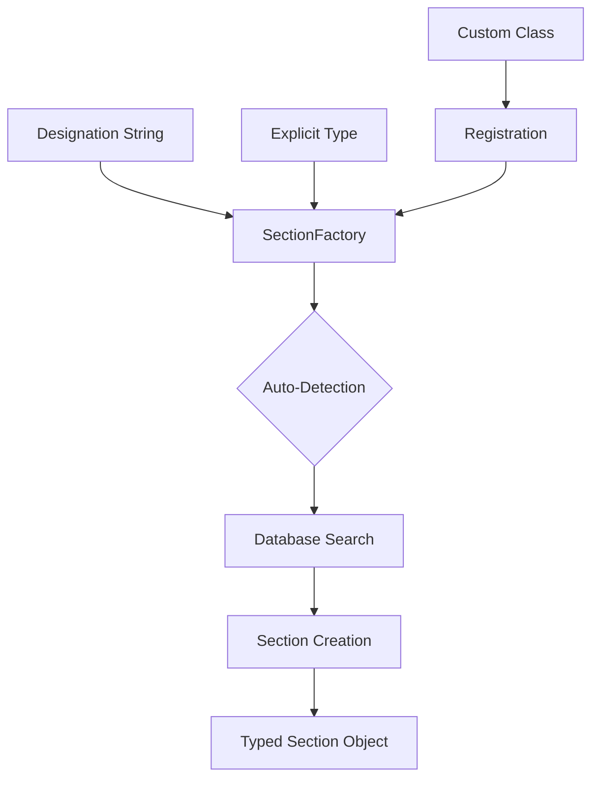

# Factory Pattern

The SteelSnakes factory pattern provides automatic section type detection and creation, making it easy to work with sections when you don't know the exact type in advance. This guide covers the factory system and its advanced features.

## Overview

The factory pattern in SteelSnakes solves a common problem: how to create the correct section object when you only have a designation string. Instead of manually determining whether "457x191x67" is a UB, UC, or other type, the factory automatically detects and creates the appropriate section.



## Basic Usage

### Getting the Factory

```python
from steelsnakes.core.sections.UK import get_factory

# Get the global factory instance
factory = get_factory()
```

### Auto-Detection

The factory can automatically determine section types:

```python
from steelsnakes.core.sections.UK import get_factory

factory = get_factory()

# These designations will be auto-detected
designations = [
    "457x191x67",      # Universal Beam
    "305x305x137",     # Universal Column
    "430x100x64",      # Parallel Flange Channel
    "200x200x24.0",    # Equal Angle
    "168.3x10.0",      # Hot Finished Circular Hollow
    "150x100x5.0",     # Cold Formed Rectangular Hollow
    "M20",             # Preloaded Bolt (8.8 grade)
    "6.0"              # Weld specification
]

print("Auto-detection results:")
for designation in designations:
    try:
        section = factory.create_section(designation)
        section_type = section.get_section_type()
        print(f"{designation:15} → {section_type.value}")
    except ValueError as e:
        print(f"{designation:15} → Error: {e}")
```

**Output:**
```
Auto-detection results:
457x191x67      → UB
305x305x137     → UC
430x100x64      → PFC
200x200x24.0    → L_EQUAL
168.3x10.0      → HFCHS
150x100x5.0     → CFRHS
M20             → BOLT_PRE_88
6.0             → WELDS
```

### Explicit Type Specification

Sometimes you want to be explicit about the section type:

```python
from steelsnakes.core.sections.UK import get_factory, SectionType

factory = get_factory()

# Create with explicit type
beam = factory.create_section("457x191x67", SectionType.UB)
column = factory.create_section("305x305x137", SectionType.UC)

print(f"Beam: {beam} (Type: {beam.get_section_type().value})")
print(f"Column: {column} (Type: {column.get_section_type().value})")
```

## Advanced Features

### Batch Creation

Create multiple sections efficiently:

```python
def create_sections_batch(designations, section_type=None):
    """Create multiple sections with optional type specification."""
    factory = get_factory()
    sections = []
    errors = []
    
    for designation in designations:
        try:
            if section_type:
                section = factory.create_section(designation, section_type)
            else:
                section = factory.create_section(designation)
            sections.append(section)
        except ValueError as e:
            errors.append((designation, str(e)))
    
    return sections, errors

# Create a batch of beams
beam_designations = ["203x133x25", "457x191x67", "914x305x201"]
beams, beam_errors = create_sections_batch(beam_designations, SectionType.UB)

print(f"Created {len(beams)} beams successfully")
if beam_errors:
    print(f"Errors: {beam_errors}")
```

### Mixed Type Creation

Handle lists with mixed section types:

```python
def process_mixed_sections(designations):
    """Process a list of mixed section designations."""
    factory = get_factory()
    
    sections_by_type = {}
    
    for designation in designations:
        try:
            section = factory.create_section(designation)
            section_type = section.get_section_type()
            
            if section_type not in sections_by_type:
                sections_by_type[section_type] = []
            
            sections_by_type[section_type].append(section)
            
        except ValueError as e:
            print(f"Could not create section {designation}: {e}")
    
    return sections_by_type

# Process mixed designations
mixed_designations = [
    "457x191x67",    # UB
    "305x305x137",   # UC
    "430x100x64",    # PFC
    "200x200x24.0",  # L_EQUAL
    "48.3x4.0"       # CFCHS
]

grouped_sections = process_mixed_sections(mixed_designations)

for section_type, sections in grouped_sections.items():
    print(f"{section_type.value}: {len(sections)} sections")
    for section in sections:
        print(f"  {section.designation}")
```

## Factory Registration

### Understanding Registration

The factory maintains a registry of section classes that it can create:

```python
from steelsnakes.core.sections.UK import get_factory

factory = get_factory()

# Check registered section classes
print("Registered section types:")
for section_type in factory._section_classes:
    section_class = factory._section_classes[section_type]
    print(f"  {section_type.value}: {section_class.__name__}")
```

### Custom Section Registration

You can register custom section classes with the factory:

```python
from dataclasses import dataclass
from steelsnakes.core.sections.UK.Base import BaseSection, SectionType

# Example: Custom section type (hypothetical)
@dataclass
class CustomSection(BaseSection):
    """Example custom section type."""
    
    custom_property: float
    
    @classmethod
    def get_section_type(cls) -> SectionType:
        # You would need to add CUSTOM to the SectionType enum
        return SectionType.CUSTOM

# Register with factory
factory = get_factory()
factory.register_section_class(CustomSection)

# Now the factory can create custom sections
# (assuming appropriate data exists in database)
```

## Error Handling

### Common Errors

The factory provides clear error messages for common issues:

```python
from steelsnakes.core.sections.UK import get_factory

factory = get_factory()

# Test various error conditions
test_cases = [
    "999x999x999",    # Non-existent section
    "",               # Empty designation
    "invalid",        # Invalid format
    None              # None input
]

for test_case in test_cases:
    try:
        section = factory.create_section(test_case)
        print(f"✓ Created: {section}")
    except ValueError as e:
        print(f"✗ Error for '{test_case}': {e}")
    except TypeError as e:
        print(f"✗ Type error for '{test_case}': {e}")
```

### Graceful Error Handling

Handle errors gracefully in applications:

```python
def safe_section_creation(designation, fallback_type=None):
    """Safely create section with fallback options."""
    factory = get_factory()
    
    # Try auto-detection first
    try:
        return factory.create_section(designation), None
    except ValueError as auto_error:
        
        # Try with fallback type if provided
        if fallback_type:
            try:
                return factory.create_section(designation, fallback_type), None
            except ValueError as fallback_error:
                return None, f"Auto-detection failed: {auto_error}. Fallback failed: {fallback_error}"
        
        return None, str(auto_error)

# Usage
section, error = safe_section_creation("457x191x67")
if section:
    print(f"Created: {section}")
else:
    print(f"Failed: {error}")
```

## Performance Considerations

### Factory Caching

The factory caches database instances and section classes for optimal performance:

```python
# Multiple calls to get_factory() return the same instance
factory1 = get_factory()
factory2 = get_factory()
print(f"Same instance: {factory1 is factory2}")  # True

# Database is cached within factory
database1 = factory1.database
database2 = factory1.database
print(f"Same database: {database1 is database2}")  # True
```

### Batch Processing Optimization

For processing many sections, consider these optimizations:

```python
def optimized_batch_creation(designations):
    """Optimized batch creation for large lists."""
    factory = get_factory()
    database = factory.database  # Cache database reference
    
    sections = []
    
    # Group by likely section type to minimize searches
    beam_like = [d for d in designations if 'x' in d and len(d.split('x')) == 3]
    bolt_like = [d for d in designations if d.startswith('M')]
    weld_like = [d for d in designations if d.replace('.', '').isdigit()]
    
    # Process each group with type hint
    for designation in beam_like:
        try:
            # Let auto-detection work, but it's faster when grouped
            section = factory.create_section(designation)
            sections.append(section)
        except ValueError:
            pass
    
    # Similar processing for other groups...
    
    return sections

# Usage for large datasets
large_designation_list = ["457x191x67"] * 1000  # Simulate large list
sections = optimized_batch_creation(large_designation_list)
print(f"Processed {len(sections)} sections")
```

## Integration Patterns

### With Pandas DataFrames

```python
import pandas as pd
from steelsnakes.core.sections.UK import get_factory

def enhance_dataframe_with_sections(df, designation_column='designation'):
    """Add section objects and properties to DataFrame."""
    factory = get_factory()
    
    # Create sections
    sections = []
    for designation in df[designation_column]:
        try:
            section = factory.create_section(designation)
            sections.append(section)
        except ValueError:
            sections.append(None)
    
    # Add section objects
    df['section'] = sections
    
    # Add common properties
    df['section_type'] = [s.get_section_type().value if s else None for s in sections]
    df['mass'] = [s.mass_per_metre if s else None for s in sections]
    df['I_yy'] = [s.I_yy if s and hasattr(s, 'I_yy') else None for s in sections]
    
    return df

# Example usage
data = {
    'member_id': ['B1', 'B2', 'C1'],
    'designation': ['457x191x67', '533x210x82', '305x305x137']
}
df = pd.DataFrame(data)
enhanced_df = enhance_dataframe_with_sections(df)
print(enhanced_df[['member_id', 'designation', 'section_type', 'mass']])
```

### With Configuration Files

```python
import json
from steelsnakes.core.sections.UK import get_factory

def load_sections_from_config(config_file):
    """Load sections from a configuration file."""
    with open(config_file, 'r') as f:
        config = json.load(f)
    
    factory = get_factory()
    
    members = {}
    for member_id, member_data in config['members'].items():
        designation = member_data['designation']
        section_type = member_data.get('type')  # Optional explicit type
        
        try:
            if section_type:
                section = factory.create_section(designation, SectionType(section_type))
            else:
                section = factory.create_section(designation)
            
            members[member_id] = {
                'section': section,
                'length': member_data.get('length'),
                'material': member_data.get('material', 'S355')
            }
        except ValueError as e:
            print(f"Error loading member {member_id}: {e}")
    
    return members

# Example config.json:
# {
#     "members": {
#         "B1": {"designation": "457x191x67", "length": 8000},
#         "C1": {"designation": "305x305x137", "type": "UC", "length": 4000}
#     }
# }
```

## Testing the Factory

### Unit Tests

Example test patterns for factory functionality:

```python
import pytest
from steelsnakes.core.sections.UK import get_factory, SectionType

def test_auto_detection():
    """Test automatic section type detection."""
    factory = get_factory()
    
    test_cases = [
        ("457x191x67", SectionType.UB),
        ("305x305x137", SectionType.UC),
        ("430x100x64", SectionType.PFC),
        ("M20", SectionType.BOLT_PRE_88)
    ]
    
    for designation, expected_type in test_cases:
        section = factory.create_section(designation)
        assert section.get_section_type() == expected_type

def test_explicit_type():
    """Test explicit type specification."""
    factory = get_factory()
    
    section = factory.create_section("457x191x67", SectionType.UB)
    assert section.get_section_type() == SectionType.UB
    assert section.designation == "457x191x67"

def test_invalid_designation():
    """Test handling of invalid designations."""
    factory = get_factory()
    
    with pytest.raises(ValueError):
        factory.create_section("invalid_designation")
```

## Next Steps

- **[Database System](database.md)** - Deep dive into database operations
- **[Search Guide](search.md)** - Advanced search techniques
- **[Examples](../examples/basic.md)** - Practical usage examples
- **[API Reference](../reference/core.md)** - Complete API documentation

!!! tip "Best Practice"
    Cache the factory instance when creating many sections to avoid repeated initialization overhead.

!!! note "Auto-Detection Logic"
    The factory uses pattern matching and database lookups to determine section types. When in doubt, it searches all available types, so explicit type specification can be faster for known types.
